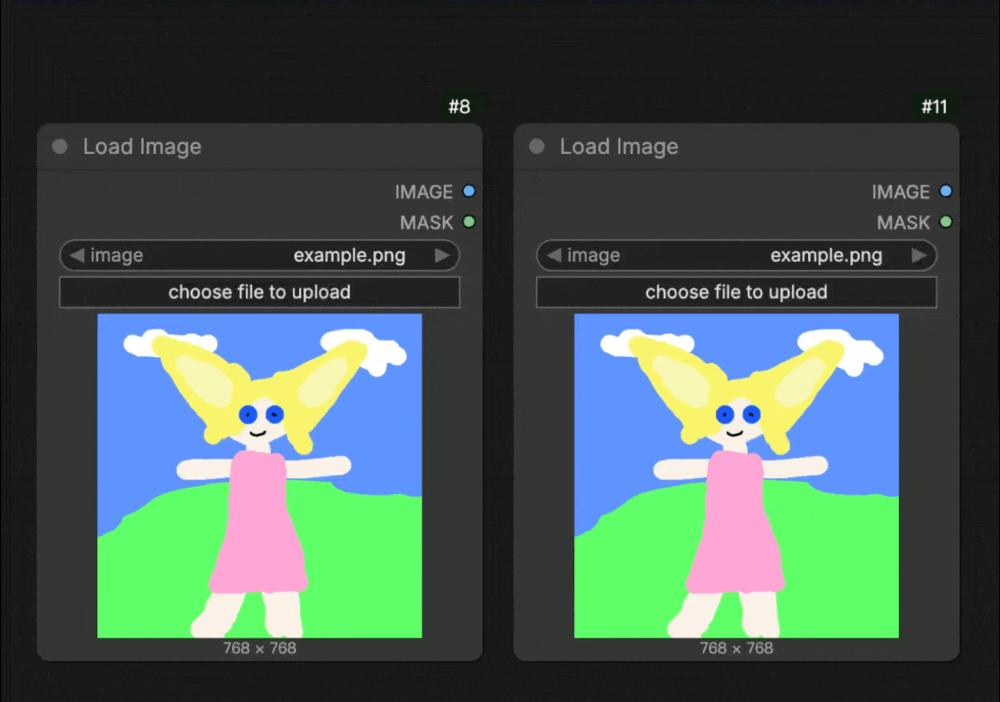
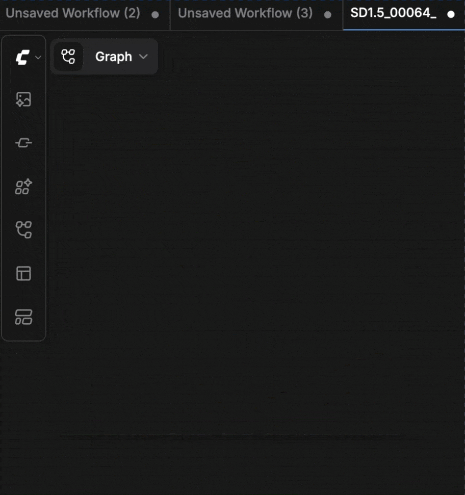

# ComfyUI-PowerLoader  
Upload media files into ComfyUI more easily, with added support for HEIF/HEIC/AVIF formats.  
**[[📃中文版](./README_zh.md)]**

## Preview

<table>
  <tr>
    <td colspan="2" align="center">
      
      <div>Uploader Overlay</div>
    </td>
  </tr>
  <tr>
    <td align="center">
      
      <div>HEIC/AVIF Support</div>
    </td>
    <td align="center">
      
      <div>Live Previewer</div>
    </td>
  </tr>
</table>

## Installation

#### Install the node:
```bash
cd ComfyUI/custom_nodes
git clone https://github.com/lihaoyun6/ComfyUI-PowerLoader.git
```

## Usage
- If there are media loader nodes (images, video/audio, etc.) in the current workflow, PowerLoader will automatically display drop targets when files are dragged into the window.  
- When the cursor leaves the target area or the <kbd>Shift</kbd> key is held down, the targets will temporarily hide, allowing the native drag-and-drop behavior to work normally.  
- You can customize the size and position of the targets in the settings.  
- **This extension will also allow you to directly upload HEIC/HEIF and AVIF images to ComfyUI.**

## Credits
- [ComfyUI](https://github.com/comfyanonymous/ComfyUI) @comfyanonymous
