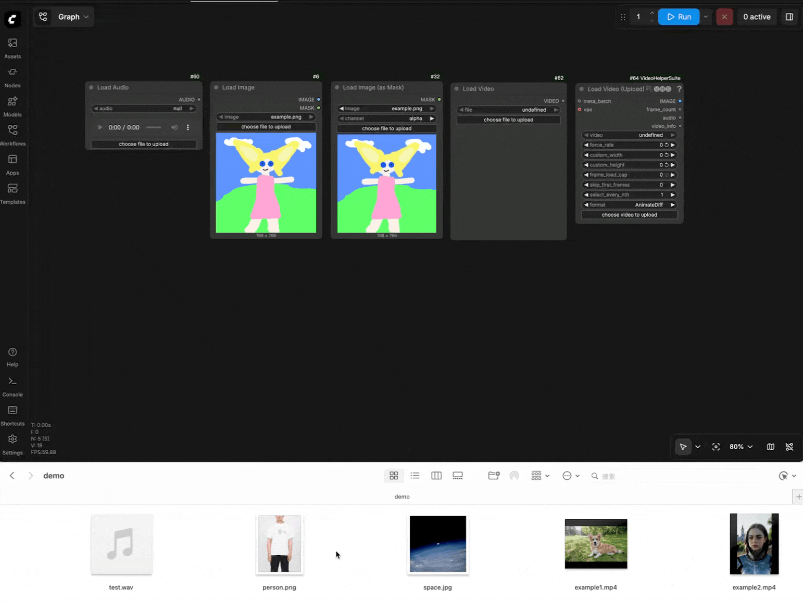

# ComfyUI-PowerLoader  
此插件允许用户以非常高效的方式向 ComfyUI 上传媒体文件  
**[[📃English](./README.md)]**

## 预览
 

## 安装  

#### 安装节点:  
```bash
cd ComfyUI/custom_nodes
git clone https://github.com/lihaoyun6/ComfyUI-PowerLoader.git
```

## 使用
- 若当前画布中有加载节点(图片, 视/音频等), PowerLoader会在用户拖拽文件时自动显示接收器.  
- 当鼠标离开接收器范围或按住 <kbd>Shift</kbd> 键时, 接收器会暂时隐藏, 不影响原生拖拽功能.  
- 你还可以在设置中修改接收器的尺寸和位置.  

## 致谢   
- [ComfyUI](https://github.com/comfyanonymous/ComfyUI) @comfyanonymous
